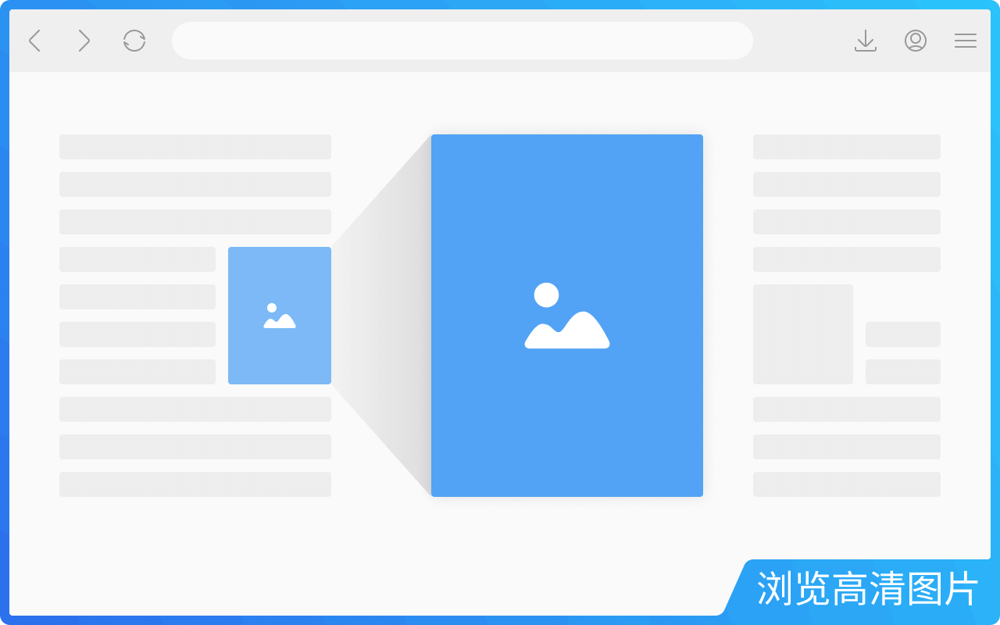
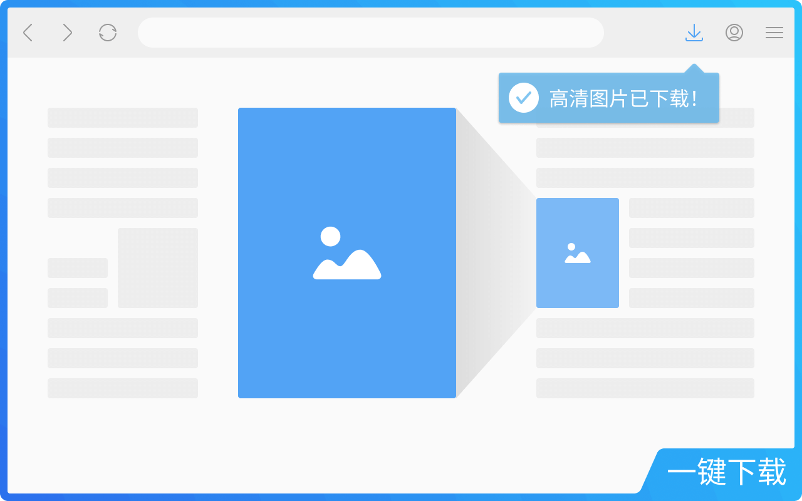
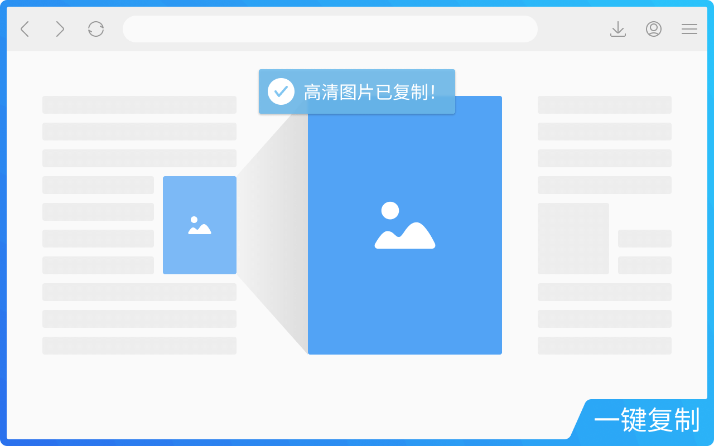
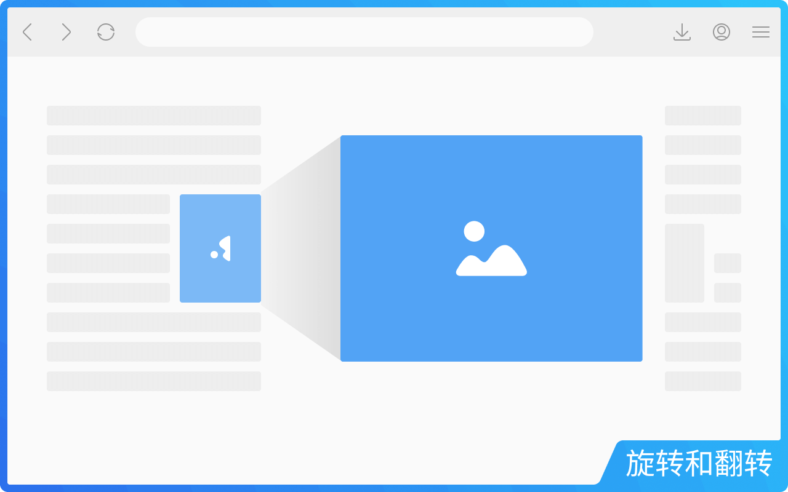
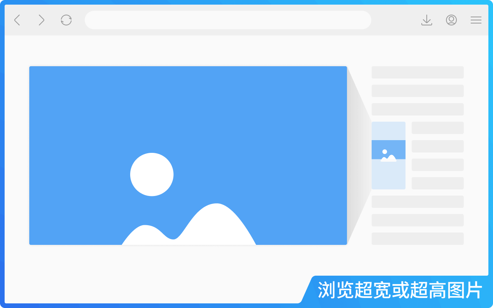
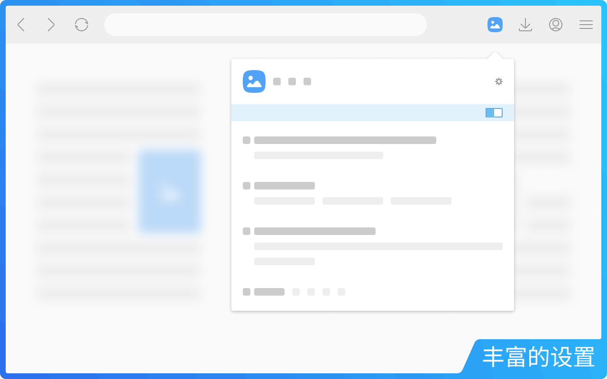

  
:link: [English](README.md) &emsp; :link: [繁體中文](README--zh-tw.md)

# 浮图秀

**浮图秀**是一款浏览器扩展，只需将鼠标悬停在缩略图或图片链接上，就能查看或下载高清图片。无缝集成于所有您所喜爱的网站。

> :information_source: _注意：本仓库源码自迁移到 Extension Manifest V3 后不再更新，但浮图秀始终被积极维护并持续改进着。_

 
 

## 目录

- :rocket: [安装浮图秀](#rocket-%E5%AE%89%E8%A3%85%E6%B5%AE%E5%9B%BE%E7%A7%80)
- :fire: [常用功能](#fire-%E5%B8%B8%E7%94%A8%E5%8A%9F%E8%83%BD)
- :gear: [个性化设置](#gear-%E4%B8%AA%E6%80%A7%E5%8C%96%E8%AE%BE%E7%BD%AE)
- :question: [常见问题](#question-%E5%B8%B8%E8%A7%81%E9%97%AE%E9%A2%98)
- :lady_beetle: [发现 BUG？](#lady_beetle-%E5%8F%91%E7%8E%B0-bug)
- :memo: [条款与隐私政策](#memo-%E6%9D%A1%E6%AC%BE%E4%B8%8E%E9%9A%90%E7%A7%81%E6%94%BF%E7%AD%96)
- :speech_balloon: [联系作者](#speech_balloon-%E8%81%94%E7%B3%BB%E4%BD%9C%E8%80%85)

 
 

## :rocket: 安装浮图秀

**浮图秀**已入驻各大浏览器应用商店并成为**推荐扩展**！点击下方安装：

-  [Google Chrome](https://chromewebstore.google.com/detail/photoshow/mgpdnhlllbpncjpgokgfogidhoegebod)
-  [Microsoft Edge](https://microsoftedge.microsoft.com/addons/detail/afdelcfalkgcfelngdclbaijgeaklbjk)
-  [Mozilla Firefox](https://addons.mozilla.org/firefox/addon/photoshow/)

 
 

## :fire: 常用功能

非常简单——访问网站，鼠标悬停在缩略图或图片链接上，浮图秀会自动探测并显示高清图片。

 

您还可以：

1. **下载图片：** 按 `S` 一键下载。
   

2. **复制图片：** 按 `Alt` + `C` 复制图片以便编辑或粘贴到聊天。
   

3. **旋转 & 翻转图片：** 修正方向问题：
   - 旋转：`Shift` + `Ctrl` + `←` / `→`
   - 翻转：`Alt` + `Ctrl` + `←` / `→`
   

   > :bulb: 小技巧：
   >
   > - 下载或复制的图片会保留您所做的旋转或翻转。

 

浮图秀提供独特的**滚动模式**来查看**超宽**或**超高**图片。此种模式下图片不会被缩小，而是在大图浮层内显示局部并在缩略图上显示**导航器**，如同放大镜效果。移动鼠标即可查看整张图片。

 

在**全景模式**下，您可以用同样的导航系统在各方向自由探索。

> :bulb: 导航快捷键：
>
> - `←` / `→` / `↑` / `↓`：逐像素移动（长按加速）。
> - `Home` / `End`：跳至顶部/底部（超高图片）。
> - `PgUp` / `PgDn`：按视口高度滚动（超高图片）。

 

### 视图模式

提供五种模式：

- **自动 (A)：** 根据大图浮层位置自动调整图片大小，按需启用“**滚动模式**”。
- **适应 (F)：** 完整显示图片，禁用“**滚动模式**”。
- **轻量 (L)：** 大图浮层不超过屏幕 1/4，按需启用“**滚动模式**”。
- **迷你 (M)：** 大图浮层不超过屏幕 1/8，按需启用“**滚动模式**”。
- **全景 (P)：** 原始尺寸显示图片，优先启用“**滚动模式**”。

> :bulb: 小技巧：
>
> - 使用括号中的字母快捷键切换视图模式。
> - 按 `V` 可在最近使用的两种视图模式间切换。
> - 上述快捷键默认禁用，可在设置中启用。

 
 

## :gear: 个性化设置

浮图秀提供两级灵活设置：

- **全局设置：** 对所有网站生效（在**扩展选项**页面）。
- **站点设置：** 仅对单个网站生效（通过工具栏弹窗访问）。

**站点设置**会覆盖**全局设置**，双层设计实现灵活控制。

 

### 主要选项包括：

- **白名单模式：** 全局禁用浮图秀，再通过弹窗对特定站点启用。
- **触发模式：** 需按辅助键才能显示大图浮层。
- **缩略图类型** 及 **触发豁免：** 控制哪些缩略图可触发大图浮层。
- **浮窗定位：** 大图浮层默认显示在缩略图旁，可选择 `中央` 以全屏显示。
- **图片信息显示：** 可显示标题、尺寸、格式或文件大小。
- **新标签页打开方式：** 选择在新标签打开图片时是否切换到前台。
- **过渡动画：** 可开启、减少或关闭动画效果。
- **键盘快捷键：** 启用/禁用特定快捷键。
- **图片下载：** 使用占位符自定义文件名（如 `我的图片/<H>/<I>`）。
- **辅助与优化：** 更多贴心功能，如标记已查看图片或启用/禁用右键菜单。
- **设置迁移：** 导出/导入设置，在跨设备同步或报告 BUG 时使用。

> :information_source: 注意：
>
> - 全局设置可随浏览器账户同步（如果在浏览器设置中启用）。
> - 站点设置因扩展数据限制，仅在本地保存。
> - 导出/导入包含两类设置。

> :bulb: 小技巧：
>
> - 文件命名可包含**路径**，如 `我的图片/<H>/<I>` → `默认下载文件夹/我的图片/(站点域名)/(图片标题)`。

 
 

## :question: 常见问题

- **为什么文件命名设置不起作用？**  
  其他扩展可能也会修改下载文件名。若未生效，请检查是否有其他扩展覆盖。

- **如何将 WebP 保存为 JPG？**  
  在**图片下载**设置中选择 `jpg` 作为文件扩展名。浮图秀会自动转换格式。

- **如何全屏查看图片？**  
  在**浮窗定位**中启用 `中央` 选项。

- **大图浮层能否在鼠标移开后保持显示？**  
  浮图秀设计为快速“即用即走”，鼠标移开大图即关闭；但该功能已计划在未来更新中加入。

- **还有哪些功能在规划中？**  
  浮图秀未来将支持：

  - [ ] 鼠标滚轮缩放
  - [ ] 在图集/轮播中切换图片
  - [ ] 自定义快捷键
  - [ ] 在大图浮层中播放视频

  敬请期待！ :smiley:

 
 

## :lady_beetle: 发现 BUG？

浮图秀会定期更新，但在为数百个站点手工适配过程中，仍可能出现偶发问题。

请通过 [Issues](../../../issues) 页面（推荐）或邮件反馈问题或功能请求，并在创建提案时：

- 尽可能多提供模板中列出的详细信息；
- 创建新提案前请先搜索现有提案。

 
 

## :memo: 条款与隐私政策

请参见 [隐私政策与使用条款](https://www.photoshow.cool/terms-zh-cn)。

 
 

## :speech_balloon: 联系作者

:email: [发送邮件](mailto:vincentwang863@gmail.com?subject=%E6%B5%AE%E5%9B%BE%E7%A7%80%E7%94%A8%E6%88%B7%E5%8F%8D%E9%A6%88%20-%20GitHub)
