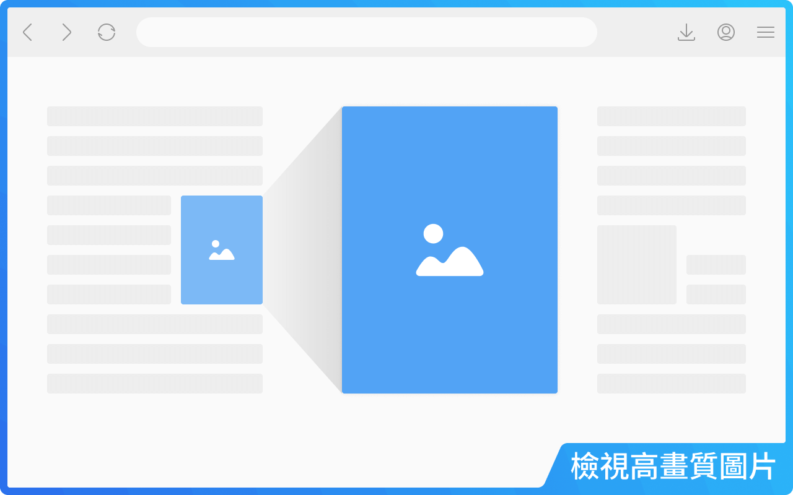
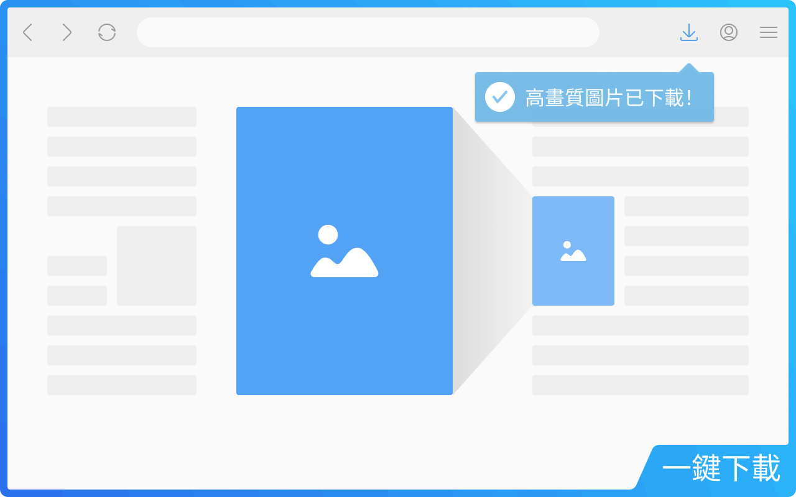
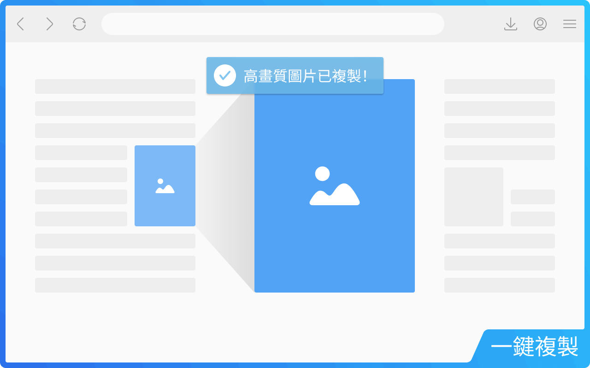
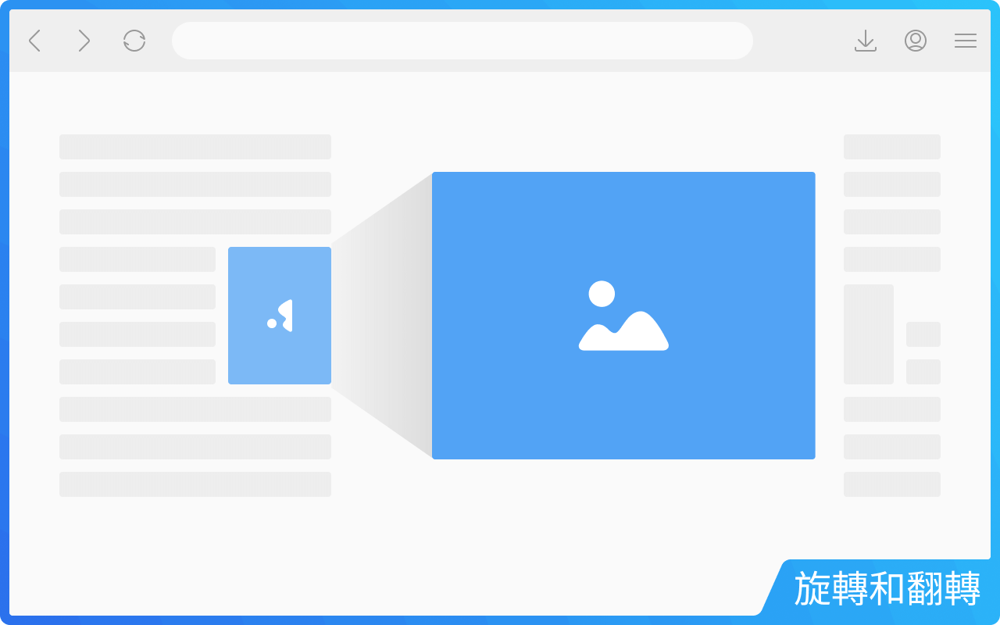
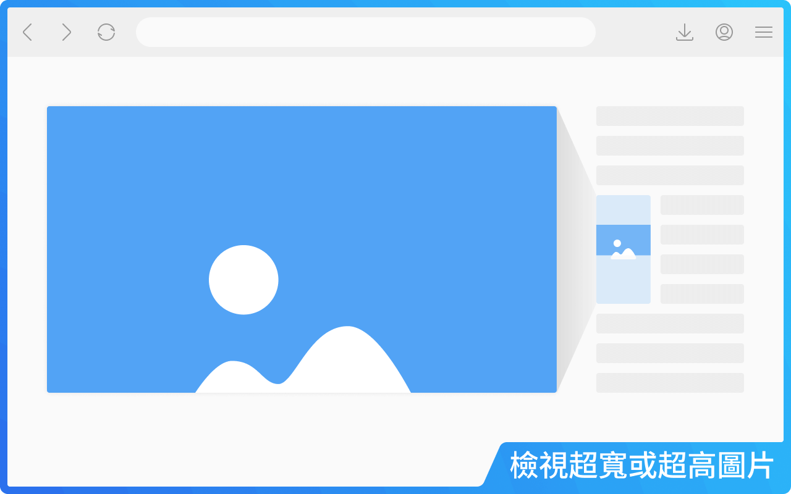
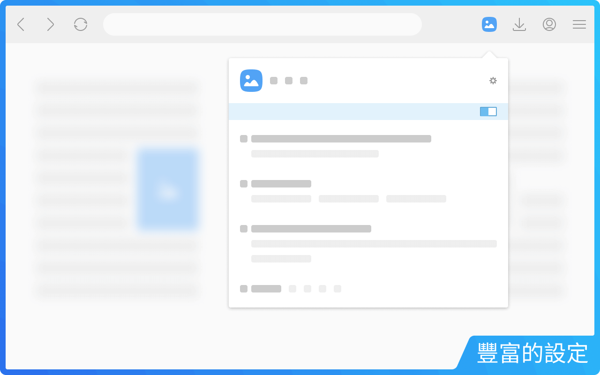

  
:link: [English](README.md) &emsp; :link: [简体中文](README--zh-cn.md)

# 浮圖秀

**浮圖秀**是一款瀏覽器擴充功能，只需將滑鼠懸停在縮圖或圖片連結上，即可檢視或下載高清圖片。無縫整合於所有您喜愛的網站。

> :information_source: _注意：本倉庫原始碼自遷移至 Extension Manifest V3 後不再更新，但浮圖秀持續被積極維護與改進。_

 
 

## 目錄

- :rocket: [安裝浮圖秀](#rocket-%E5%AE%89%E8%A3%9D%E6%B5%AE%E5%9C%96%E7%A7%80)
- :fire: [常用功能](#fire-%E5%B8%B8%E7%94%A8%E5%8A%9F%E8%83%BD)
- :gear: [個性化設定](#gear-%E5%80%8B%E6%80%A7%E5%8C%96%E8%A8%AD%E5%AE%9A)
- :question: [常見問題](#question-%E5%B8%B8%E8%A6%8B%E5%95%8F%E9%A1%8C)
- :lady_beetle: [發現 BUG？](#lady_beetle-%E7%99%BC%E7%8F%BE-bug)
- :memo: [條款與隱私政策](#memo-%E6%A2%9D%E6%AC%BE%E8%88%87%E9%9A%B1%E7%A7%81%E6%94%BF%E7%AD%96)
- :speech_balloon: [聯絡作者](#speech_balloon-%E8%81%AF%E7%B5%A1%E4%BD%9C%E8%80%85)

 
 

## :rocket: 安裝浮圖秀

**浮圖秀**已入駐各大瀏覽器應用商店並成為**推薦擴充功能**！點擊下方安裝：

-  [Google Chrome](https://chromewebstore.google.com/detail/photoshow/mgpdnhlllbpncjpgokgfogidhoegebod)
-  [Microsoft Edge](https://microsoftedge.microsoft.com/addons/detail/afdelcfalkgcfelngdclbaijgeaklbjk)
-  [Mozilla Firefox](https://addons.mozilla.org/firefox/addon/photoshow/)

 
 

## :fire: 常用功能

非常簡單——訪問網站，滑鼠懸停在縮圖或圖片連結上，浮圖秀會自動檢測並顯示高畫質圖片。

 

您還可以：

1. **下載圖片：** 按 `S` 一鍵下載。
   

2. **複製圖片：** 按 `Alt` + `C` 複製圖片以便編輯或貼到聊天。
   

3. **旋轉 & 翻轉圖片：** 修正方向問題：
   - 旋轉：`Shift` + `Ctrl` + `←` / `→`
   - 翻轉：`Alt` + `Ctrl` + `←` / `→`
   

   > :bulb: 小技巧：
   >
   > - 下載或複製的圖片會保留您所做的旋轉或翻轉。

 

浮圖秀提供獨特的**滾動模式**來檢視**超寬**或**超高**圖片。此模式下圖片不會被縮小，而是在大圖浮層內顯示局部並在縮圖上顯示**導航器**，如同放大鏡效果。移動滑鼠即可檢視整張圖片。

 

在**全景模式**下，您可以用同樣的導航系統在各方向自由探索。

> :bulb: 導航快捷鍵：
>
> - `←` / `→` / `↑` / `↓`：逐像素移動（長按加速）。
> - `Home` / `End`：跳至頂部/底部（超高圖片）。
> - `PgUp` / `PgDn`：按視口高度滾動（超高圖片）。

 

### 視圖模式

提供五種模式：

- **自動 (A)：** 根據大圖浮層位置自動調整圖片大小，按需啟用“**滾動模式**”。
- **適應 (F)：** 完整顯示圖片，禁用“**滾動模式**”。
- **輕量 (L)：** 大圖浮層不超過螢幕 1/4，按需啟用“**滾動模式**”。
- **迷你 (M)：** 大圖浮層不超過螢幕 1/8，按需啟用“**滾動模式**”。
- **全景 (P)：** 原始尺寸顯示圖片，優先啟用“**滾動模式**”。

> :bulb: 小技巧：
>
> - 可使用括號中的字母快捷鍵切換視圖模式。
> - 按 `V` 可在最近使用的兩種視圖模式間切換。
> - 上述快捷鍵預設禁用，可在設定中啟用。

 
 

## :gear: 個性化設定

浮圖秀提供兩級靈活設定：

- **全域設定：** 對所有網站生效（在**擴充選項**頁面）。
- **網站設定：** 僅對單個網站生效（透過工具列彈窗訪問）。

**網站設定**會覆蓋**全域設定**，雙層設計實現靈活控制。

 

### 主要選項包括：

- **白名單模式：** 全域禁用浮圖秀，再透過彈窗對特定網站啟用。
- **觸發模式：** 需按輔助鍵才能顯示大圖浮層。
- **縮圖類型** 及 **觸發豁免：** 控制哪些縮圖可觸發大圖浮層。
- **浮窗定位：** 大圖浮層預設顯示在縮圖旁，可選擇 `中央` 以全屏顯示。
- **圖片資訊顯示：** 可顯示標題、尺寸、格式或檔案大小。
- **新分頁開啟方式：** 選擇新分頁開啟圖片時是否切換至前台。
- **過渡動畫：** 可開啟、減少或關閉動畫效果。
- **鍵盤快捷鍵：** 啟用/禁用特定快捷鍵。
- **圖片下載：** 使用占位符自訂檔名（如 `我的圖片/<H>/<I>`）。
- **輔助與優化：** 更多貼心功能，如標記已檢視圖片或啟用/禁用右鍵選單。
- **設定移轉：** 匯出/匯入設定，用於跨設備同步或回報 BUG。

 

> :information_source: 注意：
>
> - 全域設定可隨瀏覽器帳號同步（若瀏覽器允許）。
> - 網站設定因擴充資料限制，僅在本地保存。
> - 匯出/匯入包含兩類設定。

> :bulb: 小技巧：
>
> - 檔案命名可包含**路徑**，如 `我的圖片/<H>/<I>` → `預設下載資料夾/我的圖片/(網站域名)/(圖片標題)`。

 
 

## :question: 常見問題

- **為什麼檔名設定不起作用？**  
  其他擴充功能也可能修改下載檔名，若未生效，請檢查是否有其他擴充功能覆蓋。

- **如何將 WebP 保存為 JPG？**  
  在**圖片下載**設定中選擇 `jpg` 作為檔案副檔名。浮圖秀會自動轉換格式。

- **如何全屏檢視圖片？**
  在**浮窗定位**中啟用 `中央` 選項。

- **大圖浮層能否在滑鼠移開後保持顯示？**  
  浮圖秀原設計為“即用即走”快速體驗，滑鼠移開大圖即關閉；此功能已列入未來更新計畫。

- **還有哪些功能在規劃中？**  
  浮圖秀未來將支援：

  - [ ] 滑鼠滾輪縮放
  - [ ] 在圖集/輪播中切換圖片
  - [ ] 自訂快捷鍵
  - [ ] 在大圖浮層中播放影片

  敬請期待！ :smiley:

 
 

## :lady_beetle: 發現 BUG？

浮圖秀會定期更新，但在為數百個網站手工適配過程中，仍可能出現偶發問題。

請透過 [Issues](../../../issues) 頁面（推薦）或郵件回報問題或功能請求，並在建立提案時：

- 盡可能提供模板中列出的詳細資訊；
- 建立新提案前請先搜尋現有提案。

 
 

## :memo: 條款與隱私政策

請參見 [隱私政策與使用條款](https://www.photoshow.cool/terms-zh-tw)。

 
 

## :speech_balloon: 聯絡作者

:email: [發送郵件](mailto:vincentwang863@gmail.com?subject=%E6%B5%AE%E5%9C%96%E7%A7%80%E4%BD%BF%E7%94%A8%E8%80%85%E5%9B%9E%E9%A5%8B%20-%20GitHub)
