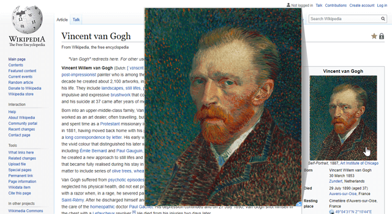
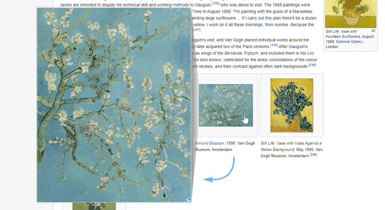
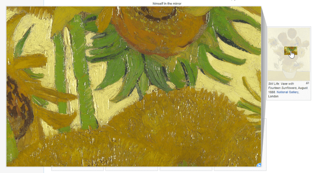
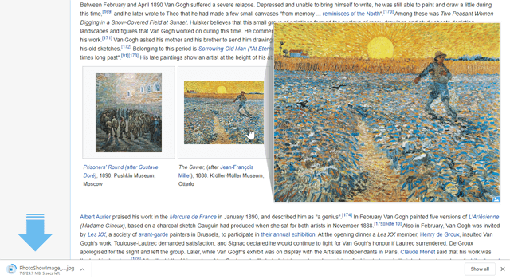
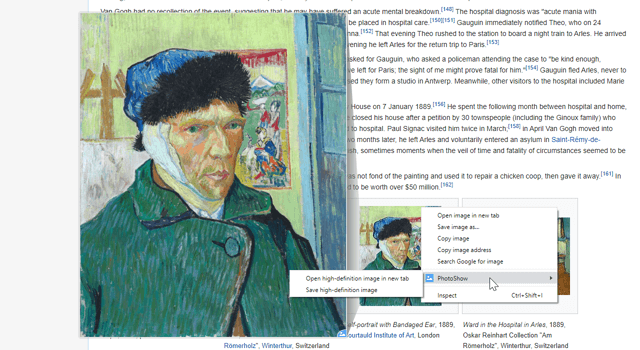
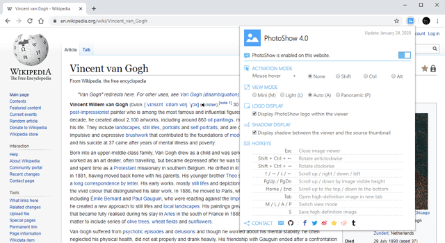

#### :link: [中文版](README_zh-CN.md)

# PhotoShow

**PhotoShow** is a browser extension helping you view high-definition images by hovering mouse on image thumbnails, greatly improving your productivity and online-life experience.
 
 

## In this article

- [Install PhotoShow](#install-photoshow)
- [How to Use it](#how-to-use-it)
- [Websites That Are Supported](#websites-that-are-supported)
- [What is ongoing](#what-is-ongoing)
- [How to Contribute](#how-to-contribute)
- [Privacy Policy & Terms of Use & License](#privacy-policy--terms-of-use--license)
- [Contact](#contact)
   
   

## Install PhotoShow

You may search and install the certain version of **PhotoShow** for your browsers from their extensions (add-ons) web stores (click the icons below):

  &emsp;
  &emsp;
  

 
 

## How to Use it

It's pretty easy - for websites that are supported by **PhotoShow** (Listed [here](#websites-that-are-supported)), hover your mouse on an image thumbnail, if **PhotoShow** can parse its URL, a viewer with a high-definition image will show alongside. For websites unknown to PhotoShow, by default, if an image is displayed in a smaller-than-intrinsic size on page, PhotoShow will display the original image.

 

While viewing HD images with **PhotoShow**, you could also -

1.  **ROTATE IMAGES:** This is especially useful for viewing photos that are posted without their orientations correctly adjusted.

    (Please note that the figure below is only for demonstrating purpose, with no source thumbnails _without their orientation correctly adjusted_.)

 

2.  **SWITCH VIEW MODE:** There are four view modes -

    - **Auto:** The viewer automatically adapts its size to the available space on one side of the source thumbnail, as is the default view mode.
    - **Mini:** The viewer displays within 1/8 in area of the available space on one side of the source thumbnail.
    - **Light:** The viewer displays within 1/4 in area of the available space on one side of the source thumbnail.
    - **Panoramic:** The viewer takes as large space as needed on one side of the source thumbnail and the image displays in its original size.

    If you think that the image viewer covers too much content of the original page, the **Mini** or **Light** mode might soothe you.

    When the image is partially displayed in the image viewer (may happen in **Auto** or **Panoramic** mode), a mask indicating the visible area will be displayed over the source thumbnail. You may scroll the image in the viewer with your mouse or via hotkeys (specified in **PhotoShow**'s popup window) and the visible area over the thumbnail will move synchronously. This is designed for inspecting image detail or browsing long pictures (such as articles delivered by images). However, please keep in mind that the hotkeys' directions are consistent with the directions that the image scrolls in the viewer rather than the moving directions of the visible area indicator - yes, they can be different if image rotations are applied.

 

3.  **DOWNLOAD IMAGES:**
    For those who wanna collect all the fantastic pictures in the world to their own galleries, just press hotkey `S` and your browser will start to download the HD image for the thumbnail under your mouse.

 

4.  **CONTEXT MENU:**
    Still feel dissatisfied with the small viewer overlay? Well, right-click on a thumbnail and **PhotoShow** offers a context menu item for opening the HD image in a new tab. You may start to download it or copy its address via context menu items here as well. (These actions can also be triggered via hotkeys.)

 

**More Settings:**
More settings are provided in the popup window, click the **PhotoShow** icon in your browser's toolbar and here you can -

- **Turn on/off PhotoShow for particular websites**: Switch the toggle button and **PhotoShow** will be enabled/disabled for websites of current hostname.
- **Toggle support for unknown websites**: PhotoShow offers basic support for its unknown websites by default - displaying original images when their intrinsic sizes are larger than they're displayed. You can toggle this behaviour here.
- **Set activation mode**: Displaying an HD image every time you hang your mouse over a thumbnail on a page might be disturbing. With this setting, you can choose to bind an "auxiliary key" for triggering the image viewer displaying - press it when you wanna see the HD images.
- **Toggle activation exemption**: Allow to disable the HD image viewer when image thumbnails are larger than 25% of the viewport.
- **Set activation delay**: Allow to set how long will it be before the HD image viewer displays when mouse hovering on thumbnails.
- **Toggle view mode**: Choose the default view mode you love!
- **Set viewer location**: Specify on which directions (relative to the source thumbnail) the HD image viewer is allowed to popup. PhotoShow will intelligently choose the best location among the ticked ones in which the HD images can get their largest display.
- **Toggle image size display**: If you are curious about the original size of the HD image, use this to toggle the image size tag displayed in the bottom-right corner of the image viewer.
- **Toggle shadow display**: If you just can't stand the dark shade between the image viewer and its source thumbnail, "KAPOW"!
- **Toggle loading states display**: Allow to disable image loading states indicator (a spinner or cross icon displayed over the thumbnails).
- **Toggle animation display**: Allow to disable all the transition animation for the HD image viewer.
- **Toggle image anti-aliasing**: Allow to enable/disable image anti-aliasing.
- **Toggle context menu**: Allow to disable PhotoShow context menu items.
- **Toggle developer mode**: If you happen to be implenmenting some great ideas on your pages, you probably don't want the injected content or hotkey system from PhotoShow to distract you from your creativity, then here you go.
- **Check and toggle the shortcuts**: If you happen to forget the hotkeys or their actions, here's the right place to go. Of course you may also disable some of them as you wish.
- **File Naming**: Here you may customise the image filenames for downloading.
- **Make everything better**: Feel free to give your feedback should you have any advice or brilliant ideas. It would, of course, be appreciated if you could share **PhotoShow** with anyone you love!

By the way, all these settings will be automatically synced with your other browser account data should it be permitted, as is a browser behavior. PhotoShow itself doesn't upload or store any of these data. (Please refer to [Privacy Policy & Terms of Use & License](#privacy-policy--terms-of-use--license).)

 
 

## Supported Websites

**PhotoShow** is continuously enlarging the list of websites it supports. This is also one of the most important reasons why eventually it chose to embrace the open-source community after so many years it was created. (Please refer to see [How to Contribute](#how-to-contribute).)

Hereby is a list of part of the websites (hostnames) that **PhotoShow** currently supports:

1.  **DESIGN / PHOTOGRAPH / GRAPHICS:**

    123rf, 500px, ArtStation, Behance, DeviantArt, Dribbble, Figma, Flickr, iStock, meiye.com, Pexels, Pinterest, pixiv, POCO, VCG.COM, WikiArt, Unsplash, zhisheji

2.  **SHOPPING / TRADING / SERVICES:**

    Alibaba, AliExpress, Alimama, Amazon, Andino, Apple, Apple App Store, Best Buy, Briscoes, Ctrip, Countdown, coupang, DHgate, dianping.com, eBay, Etsy, Google Play, Google Store, iHerb, instacart, JD, Kmart, mafengwo.cn, maoyan.com, meituan.com, Myprotein, Newegg, noel leeming, NZSALE, PBTech, sellersuniononline, suning, Taobao, Target, TheMarket, thewarehouse, Tmall, Torpedo7, Trade Me, TreatMe, vvic.com, Walmart, warehouse stationery, wsy.com, Yelp

3.  **SEARCHING / KNOWLEDGE / EXPERTISE:**

    ACP Journals, allhistory.com, Baidu, Baidu Baike, Baidu Map, Bing, Google, Google books, Google Map, GitHub, JAMA Network, JavBus, NEJM, RazorSQL, soutushenqi.com, Wiki, Yandex, yiigle.com

4.  **NEWS / SOCIAL NETWORKING / FORUMS:**

    115.com, adnmb2.com, aewtogether.org, allelitewrestling.com, cangku.icu, Duitang, e621.net, e-TALENTA, Facebook, gamer.com.tw, IMDb, Imgur, Instagram, Jandan, Konachan, LOFTER, music.163.com, nga.cn, njpwworld.com, Qzone, Reddit, TapTap, toutiao.com, Tumblr, TweetDeck, Twipu, Twitter, Sina weibo, wattpad, WeChat webpages, web-zones.ru, XDA, yande.re

5.  **VIDEOS / MUSIC:**

    Acfun, Bandcamp, bilibili, Discogs, Dizilah, douyin.com, douyu.com, Encyclopaedia Metallum, Fandango, Flixster, fox.com, fox.com.tr, haokan.baidu.com, iqiyi.com, ixigua.com, kanald.com.tr, moegirl, mxdm8.com, kuaishou.com, Pornhub, radyod.com, Rotten Tomatoes, TikTok, xiaohongshu, YOUKU, YouTube

If you can't find your favourite websites in the above list, it is always welcome to [contact the author](#contact) to get more support.
 
 

## What is ongoing

**PhotoShow** keeps optimising its functionality while enlarging its websites support list. This is why you might have already noticed that it's being updated frequently.
These days, a "big" plan is taking place as **PhotoShow** is going to be refactored for better development experience for the contributors and introducing some new features as well. Here is a rough **ONGOING LIST** from the project and functional perspectives where you may find something worth looking forward to.

- [ ] Refactor.
- [x] Support all websites, displaying original images (if their intrinsic sizes are larger than they are displayed) for those not in the websites support list.
- [ ] Add an extension `OPTIONS` page for more complex settings.
- [x] Add animation toggle configuration (allow users to turn off all the animation).
- [ ] Support customising hotkeys.
- [ ] Preload images (ideally, only for the thumbnails near the mouse cursor).
- [ ] Optimise image loading speed by automatically picking proper image sources according to their final displaying dimensions.
- [ ] Support zooming with mouse wheel.
- [ ] Support fullscreen mode and allow the viewer to be nailed.

  This also explains why the `master` branch contains no code and the current version of the **PhotoShow** project is under the `archive` branch.
   
   

## How to Contribute

It is gratefully welcome to help to make **PhotoShow** better! However, as it is in refactoring nowadays, updates for functionalities are not encouraged temporarily. You may still contribute parsing rules for new websites or maybe some great ideas.

Another task where **help is badly needed** is that the UI of **PhotoShow** needs to be translated into more languages (also including optimising existing language packages) so as to help more people in the world. The `i18n` files have already been well prepared with every item explained in detail. Are you willing to help?

Thank you all in advance!
 
 

## Privacy Policy & Terms of Use & License

Don't worry, it's pretty short and clear.

**PhotoShow** only works in the local browser environment, all the permissions it asks when being installed are only for image preview, download and other related features.

All the developers and contributors **DO NOT** collect any of your personal data and are not responsible for any loss, harm, personal information leak, disputes and/or any consequences caused by your download, use of resources (including but not limited to images) of any websites. Installing and using **PhotoShow** is deemed as your acceptance of the above terms.

We reserve the right to change this Privacy Policy at any time without notifying you respectively. Any amended Privacy Policy will be posted on relevant websites. This Privacy Policy was last updated on November 7th, 2021 and replaces any other versions previously applicable from this date.

**PhotoShow** is delivered under the [MIT License](../LICENSE). The current version also includes [jQuery](https://jquery.com/) under the terms of [jQuery License](https://jquery.org/license/).
 
 

## Contact

:e-mail: [Vincent W.](mailto:vincentwang863@gmail.com?subject=PhotoShow%20User%20Feedback%20from%20GitHub)
