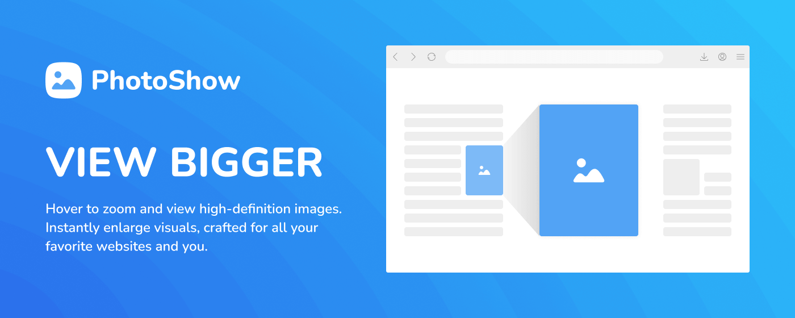
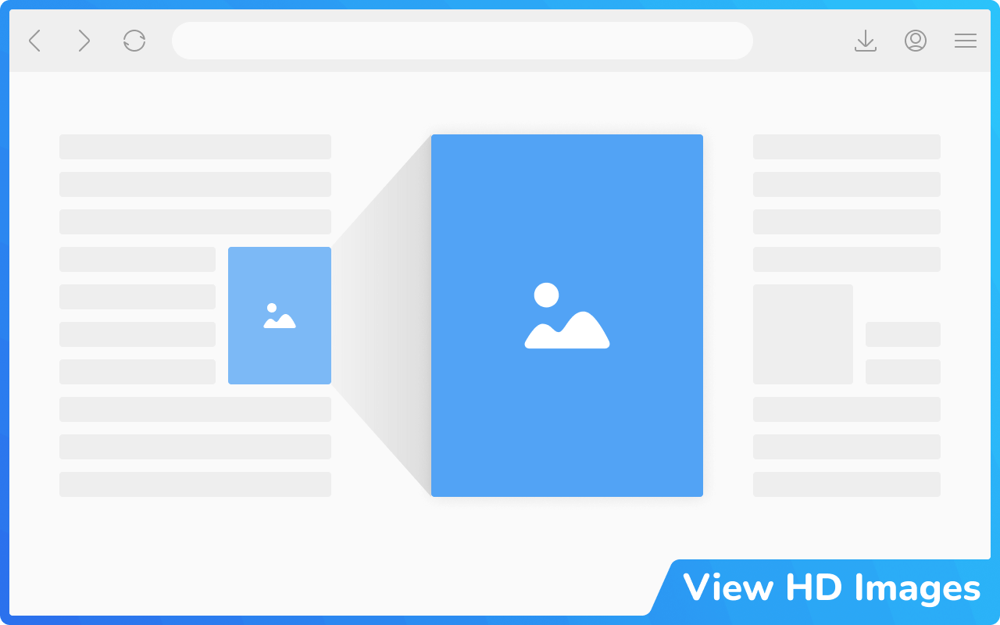
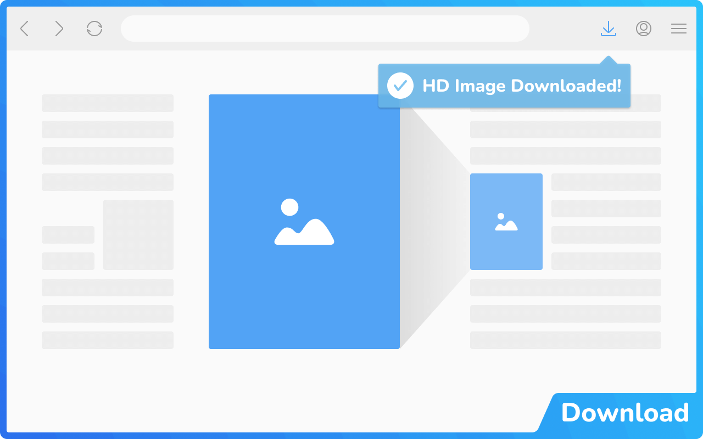
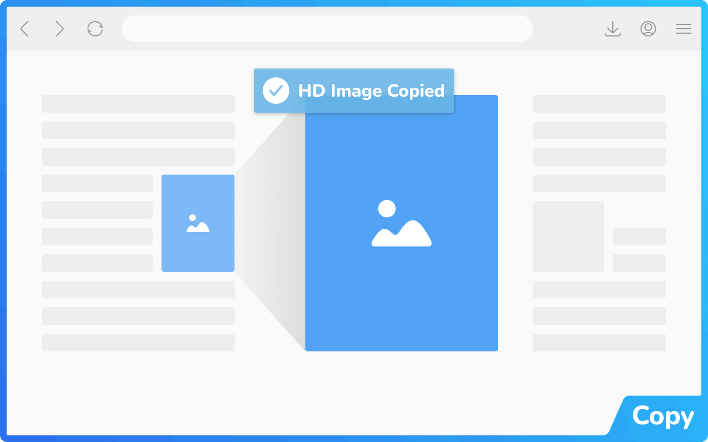
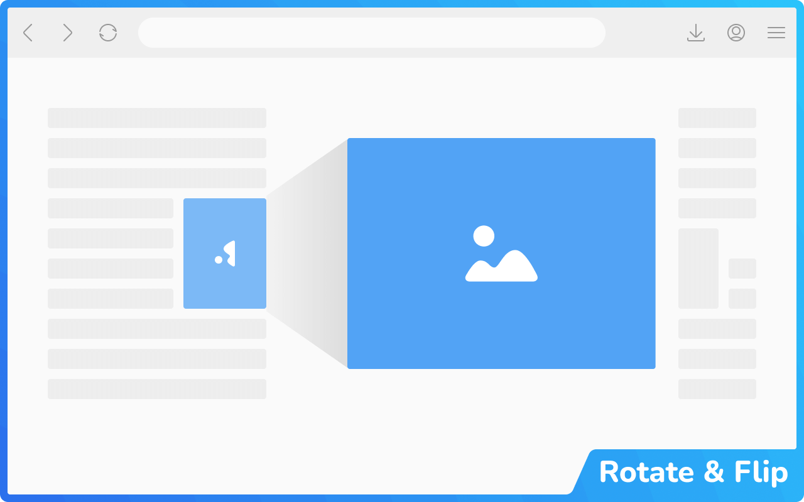
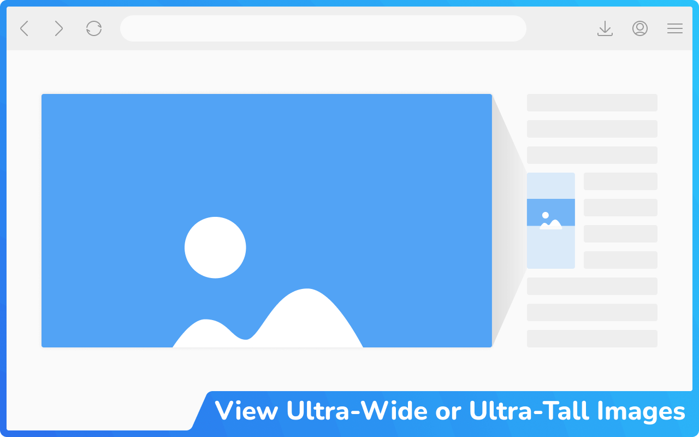
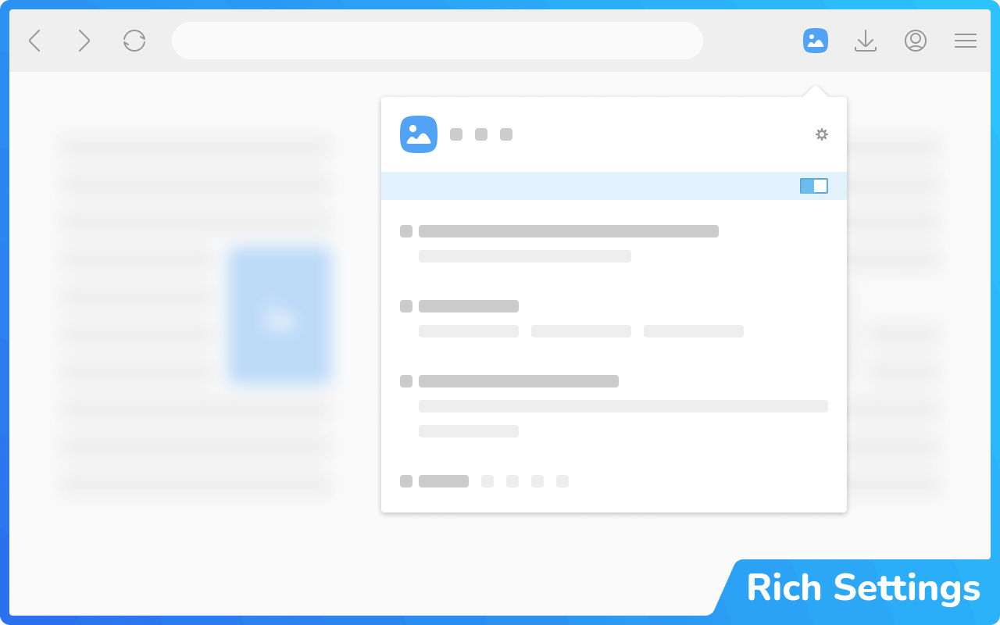
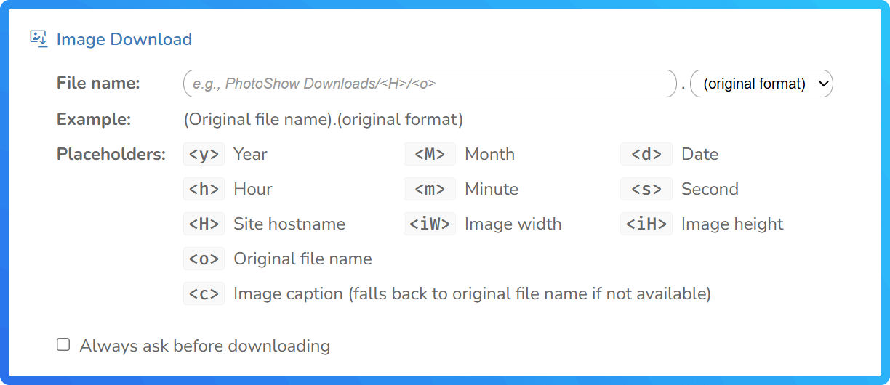

  
:link: [简体中文](README--zh-cn.md) &emsp; :link: [繁體中文](README--zh-tw.md)

# PhotoShow

**PhotoShow** is a browser extension that lets you view and download high-definition images simply by hovering over thumbnails or links. It works seamlessly across all your favorite websites.

> :information_source: _Note: The source code in this repo is no longer updated since migrating to Extension Manifest V3. PhotoShow is actively maintained and keeps evolving._

 
 

## In this article

- :rocket: [Install PhotoShow](#rocket-install-photoshow)
- :fire: [Daily-Use Features](#fire-daily-use-features)
- :gear: [Make It Your Own](#gear-make-it-your-own)
- :question: [FAQ](#question-faq)
- :lady_beetle: [Found a Bug?](#lady_beetle-found-a-bug)
- :memo: [Terms & Privacy Policy](#memo-terms--privacy-policy)
- :speech_balloon: [Contact Author](#speech_balloon-contact-author)

 
 

## :rocket: Install PhotoShow

**PhotoShow** is proudly **featured** in all major browser stores! Install it for your browser here:

-  [Google Chrome](https://chromewebstore.google.com/detail/photoshow/mgpdnhlllbpncjpgokgfogidhoegebod)
-  [Microsoft Edge](https://microsoftedge.microsoft.com/addons/detail/afdelcfalkgcfelngdclbaijgeaklbjk)
-  [Mozilla Firefox](https://addons.mozilla.org/firefox/addon/photoshow/)

 
 

## :fire: Daily-Use Features

Pretty straightforward—visit a site, hover over thumbnails or image links, and PhotoShow will detect and display the high-definition version for you.

 

You can also:

1. **Download Images:** Press `S` to save images directly into your collection.
   

2. **Copy Images:** Press `C` to copy an image for editing or pasting into chats.
   

3. **Rotate & Flip Images:** Fix unexpected orientations with:

   - Rotate: `Shift` + `Ctrl` + `←` / `→`
   - Flip: `Alt` + `Ctrl` + `←` / `→`
   

   > :bulb: Tips:
   >
   > - Rotations and flips applied to the image are preserved when copying, downloading, or opening it in a new tab.

 

PhotoShow also includes a unique **scrolling mode** for **ultra-wide** and **ultra-tall** images. Instead of shrinking them, it shows part of the HD image and overlays a **viewport mask** on the thumbnail, acting like a magnifier. Moving your mouse over the thumbnail navigates through the entire image.

 

For **Panoramic** view, you can navigate in all directions with the same viewport system.

> :bulb: Navigation shortcuts:
>
> - `←` / `→` / `↑` / `↓`: Move pixel by pixel (accelerates when held).
> - `Home` / `End`: Jump to top/bottom (ultra-tall images).
> - `PgUp` / `PgDn`: Scroll by viewport height (ultra-tall images).

 

### View Modes

Choose from six modes:

- **Auto (A):**

  The viewer is sized to fit the selected available positions, maximizing the displayed image size.
- **Fit (F):**

  The viewer is sized to fit within the selected available positions while ensuring the entire image remains fully visible, without requiring scrolling.
- **Panoramic (P):**

  The viewer is sized to display the image at its original size, filling the selected available positions as much as needed.
- **Lite (L):**

  The viewer is sized so that the shorter side of the image does not exceed 800 px, while fitting within the selected available positions.
- **Mini (M):**

  The viewer is sized so that the shorter side of the image does not exceed 500 px, while fitting within the selected available positions.
- **Tiny (T):**

  The viewer is sized so that the shorter side of the image does not exceed 300 px, while fitting within the selected available positions.

> :information_source: Note:
>
> View modes other than “**Fit**” may enable image scrolling or navigation when needed (e.g., for large or ultra-wide/tall images). When this happens, the viewer is automatically positioned around the thumbnail to support those interactions.

> :bulb: Tips:
>
> - Use the shortcut letter in parentheses to switch modes.
> - Press `V` to toggle between the last two modes.
> - These shortcuts are disabled by default but can be enabled in settings.

 
 

## :gear: Make It Your Own

PhotoShow offers flexible settings at two levels:

- **Global Settings:** Apply to all sites (found in the extension **Options** page).
- **Site-Specific Settings:** Apply to a single site (accessible via the toolbar popup).

**Site settings** override **global ones**. This dual-level design gives you full control.

 

### Key options include:

- **Whitelist Mode**: Disable PhotoShow globally, then enable per site with its popup toggle.
- **Viewer Trigger**: Require an assist key press to show the viewer.
- **Thumbnail Types** & **Viewer Exceptions**: Control which thumbnails trigger the viewer.
- **Viewer Color Scheme** & **Viewer Style**: Choose either `light` or `dark` theme as well as styles for the viewer.
- **Transition Animation**: Smooth animations, or reduce/disable them.
- **View Modes**: Change viewer size and the interaction mode.
- **Viewer Positions**: Default is beside the thumbnail, but you can allow fullscreen by choosing `Overlap`.
- **Image Info Display**: Show image captions, dimensions, formats, or file sizes.
- **New Tab Opening Behavior**: Choose whether new image tabs open in the foreground or background.
- **Keyboard Shortcuts**: Enable/disable specific shortcuts.
- **Image Download**: Customize filenames with placeholders (e.g. `my images/<H>/<c>`).
- **Assistance & Enhancements**: Extra tools like marking viewed images or enabling/disabling context menu items.
- **Performance Optimisations**: Improve performance by disabling features that may require more system resources.
- **Settings Management**: Export/import your settings to transfer between devices, or reset either global or site-specific settings.

 

> :information_source: Notes:
>
> - Global settings are synced with your browser profile by default (this can be disabled in the browser's settings).
> - Site-specific settings are stored locally, due to technical limitations.
> - Export and import include both types of settings.

> :bulb: Tips:
>
> - When the viewer is centered in the viewport, ultra-tall or ultra-wide images will not use "**scroll mode**". To make it work in those cases, enable all **Viewer Positions** options. PhotoShow will then automatically select the most suitable position, maximizing viewer size and applying the mode when needed.
> - File naming can include **paths**, e.g. `my images/<H>/<c>` → `default download folder/my images/(hostname)/(image caption)`.
> - For more information about **advanced filename placeholders**, please refer to [Using Advanced Filename Placeholders and Placeholder Modifiers](./ADVANCED_FILENAME_PLACEHOLDERS.md).

 
 

## :question: FAQ

- **Why does “NVIDIA RTX VSR” stop working when PhotoShow is enabled, and how can it be fixed?**  
  This can happen because some of PhotoShow’s visual effects—particularly background blur—are GPU-intensive and may interfere with how NVIDIA RTX Video Super Resolution (VSR) is applied. When these effects are active, VSR may not engage as expected.

  To resolve this, enable the option that simplifies visual effects:

  1. Go to **PhotoShow Settings (Options page)**
  2. Enable:

     - **Utilities** → **Other Settings** → “**Reduce performance impact by simplifying visual effects**” (prior to version 4.87.0) or
     - **Appearance** → **Viewer Style** → “**Reduce performance impact by simplifying visual effects**” (since version 4.87.0) or
     - **Utilities** → **Performance Optimisations** → “**Simplify viewer visual effects**” (since version 4.91.0)

  After enabling the option, refresh the page or restart your browser to ensure the change takes effect if necessary.

- **Why don’t file naming settings work?**  
  Other extensions may rename downloads too. If filenames aren’t applied, check whether another extension is overriding them.

- **Why am I asked to choose a download location every time?**  
  By default, PhotoShow saves images automatically to your browser’s/system’s default download folder, which can be configured in the **Image Download** settings.

  

  If you are prompted to choose a location every time, try these steps:

  - Turn off the "**Always ask before downloading**" option in PhotoShow’s Image Download settings.
  - Turn off any similar "always ask" options in your browser’s own download settings.
  - Check if you have other extensions that manage downloads and adjust their settings if needed.

- **Why does PhotoShow seem unable to remember my last image saving location?**  
  PhotoShow does remember the saving location you configure in its **Image Download** settings. This location is always based on your browser/system’s default download folder.

  What may look like "not remembering" happens if you manually select a folder **outside the default download folder** during a download. For security reasons, extensions cannot reuse such folders automatically.

  If you prefer to pick a folder freely each time, you can enable the "**Always ask before downloading**" option.

- **How do I save WebP as JPG?**  
  In **Image Download** settings, select `jpg` as the file extension. PhotoShow converts the format automatically when saving.

- **How do I view fullscreen images?**  
  Enable the `Overlap` option under **Viewer Positions**. This allows the image viewer to overlap the thumbnail and use up to the entire screen for displaying the image.

  > :information_source: Note:
  >
  > **View Modes** other than “**Fit**” may enable image scrolling or navigation when needed (e.g., for large or ultra-wide/tall images). When this happens, the viewer is positioned around the thumbnail to support those interactions and therefore may not expand to fullscreen.

- **Can the viewer stay on screen after moving the mouse away?**  
  Not yet. PhotoShow is designed for a quick, clean “fast-in fast-out” experience, so the viewer closes automatically when your mouse leaves. A future update will add more options for this behavior.

- **What else are on the roadmap?**  
  PhotoShow will eventually support

  - [ ] zooming with the mouse wheel
  - [ ] switching between images in galleries/carousels
  - [ ] customizing shortcuts
  - [ ] viewing videos within the viewer

  Stay tuned! :smiley:

 
 

## :lady_beetle: Found a Bug?

PhotoShow is regularly updated, but occasional bugs may appear, especially since it’s carefully hand-crafted for hundreds of sites.

Please discuss, report bugs or request features on [Discord Community](https://discord.com/invite/U7cSS4bDfU) (preferred), the [GitHub Issues](../../../issues) page or via email.

To help us, please:

- Fill in as much detail as possible using the issue templates.
- Search existing issues before opening a new one.

 
 

## :memo: Terms & Privacy Policy

See [Privacy Policy & Terms of Use](https://www.photoshow.cool/terms).

 
 

## :speech_balloon: Contact Author

:email: [Send Email](mailto:vincentwang863@gmail.com?subject=PhotoShow%20User%20Feedback%20-%20GitHub)
