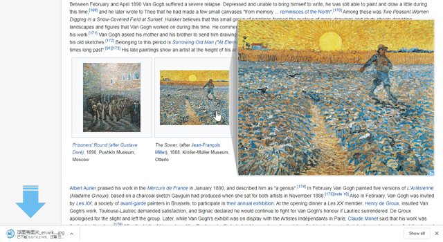
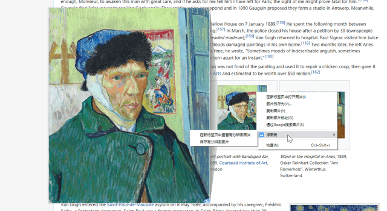
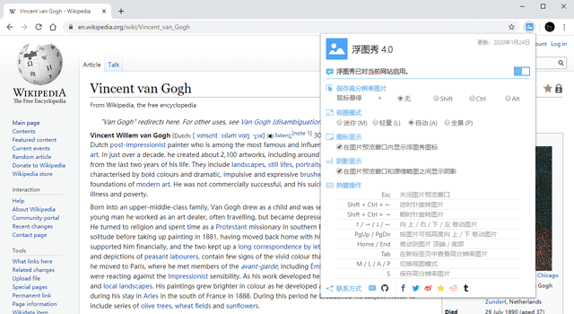

#### :link: [English Version](README.md)

# 浮图秀

**浮图秀**是一款帮助用户快速查看页面中缩略图所对应“大图”的浏览器插件。对于所支持的网站，用户鼠标悬停在缩略图时即可看到对应的高分辨率图片。
 
 

## 章节索引

- [安装说明](#%E5%AE%89%E8%A3%85%E8%AF%B4%E6%98%8E)
- [使用方法](#%E4%BD%BF%E7%94%A8%E6%96%B9%E6%B3%95)
- [支持网站](#%E6%94%AF%E6%8C%81%E7%BD%91%E7%AB%99)
- [项目进展](#%E9%A1%B9%E7%9B%AE%E8%BF%9B%E5%B1%95)
- [参与指南](#%E5%8F%82%E4%B8%8E%E6%8C%87%E5%8D%97)
- [协议许可](#%E5%8D%8F%E8%AE%AE%E8%AE%B8%E5%8F%AF)
- [联系作者](#%E8%81%94%E7%B3%BB%E4%BD%9C%E8%80%85)
   
   

## 安装说明

您可以通过各大浏览器应用市场（点击下列图标直达）搜索并安装**浮图秀**：

  &emsp;
  &emsp;
  

 
 

## 使用方法

超简单的——对于**浮图秀**所支持的网站（请参阅[此列表](#%E6%94%AF%E6%8C%81%E7%BD%91%E7%AB%99)），当您鼠标悬停在页面中的某缩略图上时，若浮图秀能够解析其链接，则会在其旁边展示对应的高分辨率大图；对于浮图秀未知的网站，默认设置下，如果页面中的缩略图所链接到的图片尺寸大于其在页面中所展示的尺寸，则浮图秀以较大尺寸展示该原图。

 

当通过**浮图秀**查看高分辨率大图时，您还可以进行如下操作：

1.  **旋转图片：** 特别适用于未经正确调整方向便发布的图片。

    （注：下图仅用于演示目的，图中没有任何源缩略图*“未经正确调整方向”*。）

 

2.  **切换视图模式：** 共有四种模式——
    - **自动：** 图片预览窗口自适应源缩略图旁侧空间；此为默认视图模式。
    - **迷你：** 图片预览窗口以不超过源缩略图旁侧空间 1/8 的面积显示。
    - **轻量：** 图片预览窗口以不超过源缩略图旁侧空间 1/4 的面积显示。
    - **全景：** 图片预览窗口根据需要尽可能大地呈现，图片以其原始尺寸显示。

若您觉得**浮图秀**图片预览浮层遮挡了太多页面内容，不妨试试**迷你**或**轻量**模式。

当高分辨率大图在图片预览浮层中部分展示时（在**自动**或**全景**模式下可能出现），在源缩略图上会显示一个用于指示图片可视区域的遮罩。您可以通过鼠标或快捷键（在**浮图秀**弹窗中有具体描述）在图片预览浮层中卷动查看图片，此时缩略图上的可视区范围将同步移动。此功能是为查看图片细节或超长图片（例如通过图片发布的文章等）而设计的。不过请留意：快捷键的操作方向与图片在图片预览浮层中的卷动方向相一致，而非可视区指示范围的移动方向——诚然，在图片经过旋转后，之二者可能并不相同。

 

3.  **下载图片：**

对于美图收集爱好者们来说，快捷键 `S` 可以帮您一键下载高分辨率大图，将网际万千美图尽纳囊中。

 

4.  **右键菜单：**

图片预览浮层仍然满足不了您欣赏大图的热情？好吧，请在缩略图上右键单击，您可以看到**浮图秀**提供了“在新标签页中查看高分辨率图片”的选项；同样您也可以通过右键菜单下载高分辨率大图或复制其地址。（这些操作也可以通过快捷键触发。）

 

**更多设置：**

**浮图秀**弹窗中提供了更多设置内容，在浏览器工具栏中点击**浮图秀**图标即可看到：

- **对特定域名启用/关闭浮图秀**：通过该按钮可为特定域名下的所有网站启用或关闭**浮图秀**。
- **随处可用**：浮图秀对其未知的网站默认提供基本支持——当图片的原始尺寸大于其显示尺寸时，展示原始图片；您可以在此启用/关闭该行为。
- **激活模式**：每次鼠标停在页面中某个缩略图上时都弹出高分辨率大图可能有点烦，通过此设置项您可以为触发图片预览浮层添加一个辅助按键——仅在您需要时按下此键来查看大图。
- **激活豁免**：当缩略图尺寸大于视窗面积的 25% 时，允许禁用大图弹窗。
- **激活延迟**：允许指定当鼠标在缩略图上悬停多久后才激活展示高分辨率大图。
- **视图模式**：指定默认的视图模式。
- **浮窗定位**：指定高分辨率大图预览窗基于源缩略图的弹出方位，浮图秀将在勾选的允许位置间自动选择可将图片最大化展示的方位。
- **尺寸显示**：如果您需要关注高清图片的原始尺寸，此设置允许您在图片预览浮层右下角显示相关信息。
- **阴影显示**：如果您受不了图片预览浮层与源缩略图之间的阴影，干掉它！
- **加载状态**：允许关闭图片加载状态的提示动画（展示于源缩略图之上的加载动画或错误图标）。
- **过渡动画**：允许禁用图片预览窗的各种过渡动画效果。
- **右键菜单**：允许禁用右键菜单项。
- **开发模式**：在浏览器处于开发模式（开发者工具窗口打开）时，允许暂时停用浮图秀以减少其对页面开发的干扰。
- **热键操作**：若您碰巧忘记了那些热键或其操作定义，来这儿就对了。当然，您也可以在此禁用某些不需要的热键。
- **文件命名**：在这里您可以自定义下载图片的文件名。
- **让一切更美好**：如您有意见建议或绝妙想法，欢迎反馈给我们。当然了，若幸能得君与亲朋好友们分享**浮图秀**，不胜感激。

对了，所有的设置项都会随浏览器账户数据自动同步（如果得到授权），这是浏览器行为，浮图秀自身并不上传或存储相关数据。（更多说明请参阅[协议许可](#%E5%8D%8F%E8%AE%AE%E8%AE%B8%E5%8F%AF)一节。）

 
 

## 支持网站

**浮图秀**会持续扩展其支持的网站列表，这也是其首次发布历经多年后，最终选择拥抱开源阵营的重要原因之一。详情请参阅[参与指南](#%E5%8F%82%E4%B8%8E%E6%8C%87%E5%8D%97)一节。

附上**浮图秀**当前所支持的部分网站（域名）列表：

1.  **设计 / 摄影 / 图库 类：**

    123rf、500px、ArtStation、Behance、DeviantArt、Dribbble、Figma、Flickr、iStock、Pexels、Pinterest、pixiv、Unsplash、WikiArt

    花瓣网、昵图网、汇图网、POCO、站酷、站酷海洛、致设计

2.  **购物 / 出行 / 服务 类：**

    1-day、Alibaba、AliExpress、Amazon、Andino、Apple、Best Buy、Briscoes、Countdown、coupang、DHgate、eBay、Etsy、Google Play、instacart、Kmart、Myprotein、Newegg、noel leeming、NZSALE、PBTech、Target、TheMarket、thewarehouse、Torpedo7、Trade Me、TreatMe、Walmart、warehouse stationery、Yelp

    携程、当当、大众点评、多看、京东、一号店、马蜂窝、猫眼电影、美团、小米、小米有品、苏宁易购、天猫、淘宝、一淘、1688、阿里妈妈、阿里健康大药房、飞猪、途牛、搜款网、网商园

3.  **搜索 / 知识 / 专业 类：**

    ACP Journals、Bing、Google、Google books、Google Map、GitHub、JAMA Network、NEJM、Wiki、yiigle.com

    全历史、百度、百度百科、百度地图、搜图神器、知乎

4.  **新闻 / 社交 / 社区 类：**

    e621.net、Facebook、IMDb、Imgur、Instagram、Reddit、TapTap、Tumblr、TweetDeck、Twipu、Twitter、wattpad、yande.re

    115 网盘、A 岛匿名版、巴哈姆特、百度贴吧、豆瓣、堆糖、煎蛋、乐乎、网易云音乐、NGA 玩家社区、QQ 空间、今日头条、微博、微信公众号

5.  **视频、音乐 类：**

    Acfun、Bandcamp、Discogs、Encyclopaedia Metallum、Fandango、Flixster、Pornhub、Rotten Tomatoes、TikTok、YouTube

    bilibili、抖音、斗鱼、好看视频、快手、西瓜视频、优酷、土豆

如果上述列表中不包含您所钟爱的网站，欢迎[向作者反馈](#%E8%81%94%E7%B3%BB%E4%BD%9C%E8%80%85)以获取更多支持。
 
 

## 项目进展

**浮图秀**通过持续迭代优化功能并扩展网站支持范围，可能您已经发现其更新频繁。

近来，一项“大计划”正在进行中——为了给参与者们提供更好的开发体验及引入更多新特性，**浮图秀**计划重构。以下**任务列表**是从功能及项目视角的一份粗略梳理，也许会有值得您期待的内容：

- [ ] 重构。
- [x] 支持所有网站，对域名不在解析列表中的网站，如果页面图片的展示尺寸小于其原始尺寸，则对原图予以展示。
- [ ] 为扩展添加 `OPTIONS` 页以支持更多更复杂的设置。
- [x] 添加动画启闭配置项以允许用户关闭所有动画。
- [ ] 支持自定义热键。
- [ ] 支持高分辨率图片预加载（理想情况下，应仅针对光标附近的缩略图）。
- [ ] 优化高分辨率图片加载速度，根据图片预览浮层最终展示尺寸自动选择相匹配的图片源。
- [ ] 支持鼠标滚轮自由缩放。
- [ ] 支持全屏模式及全屏驻停展示。

这也解释了为何目前**浮图秀**项目的 `master` 分支下并没有代码而当前版本的工程位于 `archive` 分支。
 
 

## 参与指南

衷心欢迎您参与建设**浮图秀**！鉴于目前项目仍在重构之中，故暂不建议针对功能方面进行更新。不过，您仍可贡献新的网站图片解析规则，或者提供好的点子。

另一个**亟需帮助**的的地方是：**浮图秀**的用户界面需要被翻译成更多语言（包括优化目前已有的语言包），以帮助世界上更多的人。`i18n` 文件早已准备妥当，每一个翻译项都附有详细的说明。您愿意提供帮助吗？

提前感谢大家！
 
 

## 协议许可

别担心，这里没有长篇大论，几句话就说完了：

**浮图秀**仅工作于浏览器本地环境，插件安装时所需的权限仅用于图片的展示、下载及其他相关功能。

插件的所有开发者、参与者并不收集您的任何个人数据，也不对您因使用浮图秀造成的任何损失、伤害，个人信息泄露或因非法下载、使用任何网站资源（包括但不限于图片）所造成的纠纷及后果承担责任。安装使用浮图秀即视为您接受上述条款。

我们保留随时更改本隐私政策而无需单独通知您的权利。任何修改后的隐私政策都将发布在相关网站上。本隐私政策最后一次更新是在 2021 年 11 月 7 日，取代了此前适用的任何早期版本。

**浮图秀**基于[MIT 开源协议](../LICENSE)发行。当前版本引用了 [jQuery](https://jquery.com/)，遵循 [jQuery 协议](https://jquery.org/license/)。
 
 

## 联系作者

:e-mail: [Vincent W.](mailto:vincentwang863@gmail.com?subject=%E6%B5%AE%E5%9B%BE%E7%A7%80%E7%94%A8%E6%88%B7%E5%8F%8D%E9%A6%88%20-%20%E6%9D%A5%E8%87%AA%20GitHub)
